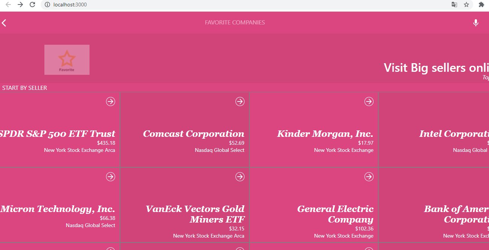
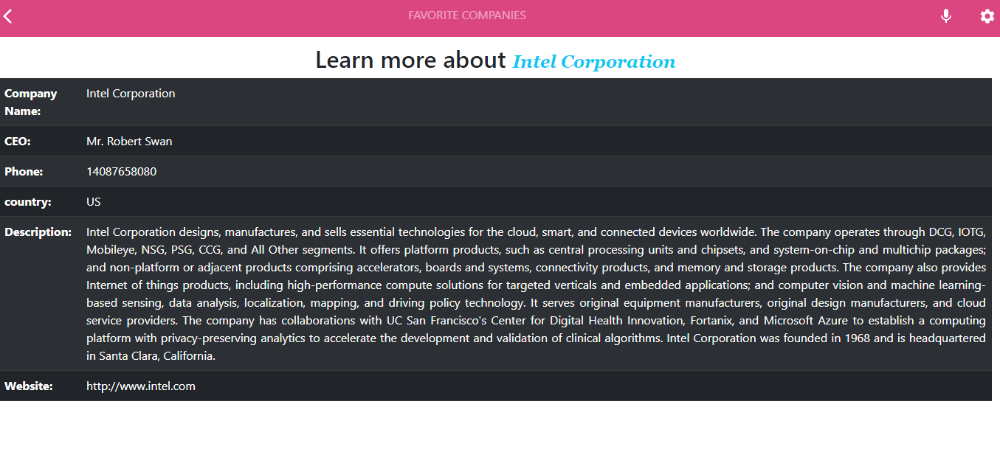

# Favorite Companies

## The React Web App uses Financial modeling prep API to retrieve top sellers all over the world and allow users to get detailed information on each one.

## Project screenshots:

#### 1. HomePage page

#### 2. DetailsPage page

## Built With

- HTML
- CSS
- JavaScript
- React
- Redux
- Netlify

## Live Demo

[Live Demo Link]()

## Video

[Project Overview](https://www.loom.com/share/d14a7fe3ebb74b298521a0644e683a10)

## Getting Started

### To get a local copy up and running follow these simple example steps.

- Clone the repo with `https://github.com/elyor-doniyorov/favorite-companies.git`
- Open your terminal or command line
- Run `git clone` and paste the link
- Open the folder with your code editor
- Create a branch to work on
- Run `npm install`
- Run `npm run build`
- Run `npm run start` to launch the server.

## Authors

👤 **Elyor Doniyorov**

## Elyor's Profile

- Github: [@elyor-doniyorov](https://github.com/elyor-doniyorov)
- LinkedIn: [@elyor-doniyorov](www.linkedin.com/in/elyor-doniyorov)

## 🤝 Contributing

Contributions, issues, and feature requests are welcome!

Feel free to check the [issues page](https://github.com/elyor-doniyorov/favorite-companies/issues/2).

## Show your support

Give a ⭐️ if you like this project!

## Acknowledgments

- A special thanks to Microverse for inspiring this project. We are indebted to you all at Microverse
- A special thanks goes to all our peers at Microverse for being there for us.

## 📝 License

This project is [MIT]() licensed.
